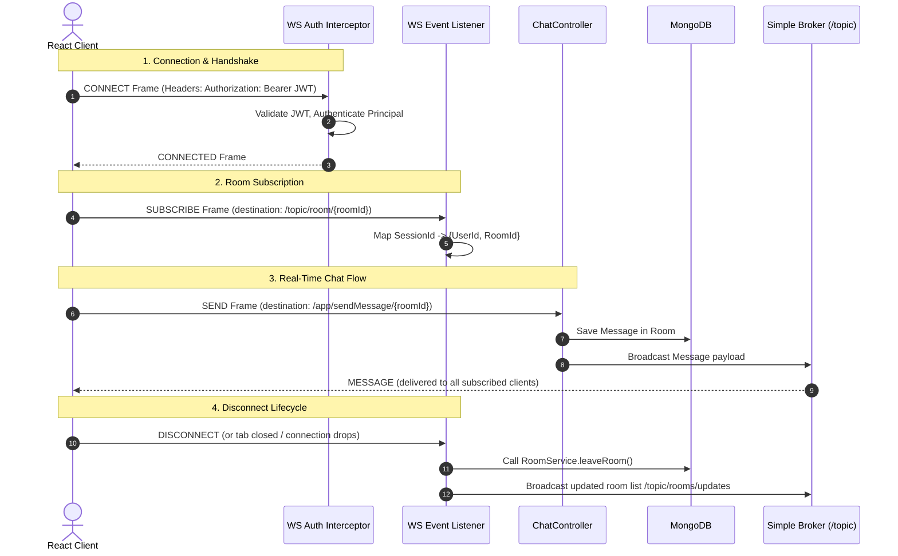

# Real-Time Chat Application

A mobile-responsive, modern real-time chat application built using **Spring Boot (Backend)**, **React.js (Frontend)**, and **MongoDB (Database)**. This application provides secure user authentication, instant chat room creation, real-time message sync, and room membership tracking using WebSockets and STOMP.

---

## 🚀 Technology Stack

* **Frontend**: React 19, Vite, TailwindCSS (v4), Axios, `@stomp/stompjs`, `sockjs-client`
* **Backend**: Spring Boot 3.x, Spring Security, Spring WebSocket, JWT Authentication
* **Database**: MongoDB (for persistent storage of users, rooms, and chat histories)

---

## 🔌 How WebSockets Work

Traditional HTTP follows a **request-response (client-pull)** model. The client requests data, and the server responds. For real-time updates (like chat), HTTP requires constant polling, which is highly inefficient.

**WebSocket** is a protocol (standardized in RFC 6455) that enables **full-duplex, bidirectional communication** over a single TCP connection.

```
Client                                      Server
  |                                           |
  | ------ HTTP GET (Protocol Upgrade) -----> | (1) Handshake Request
  | <----- 101 Switching Protocols ---------- | (2) Handshake Response
  |===========================================| 
  |             [WebSocket Connection]        | (Persistent TCP tunnel)
  |                                           |
  | <========== Real-Time Message ===========>| (3) Bidirectional Flow
  | <========== Real-Time Message ===========>| 
  |                                           |
  | ------ Close Frame (Disconnect) --------> | (4) Connection Closed
  v                                           v
```

1. **The Handshake**: The connection begins with a standard HTTP request from the client. It includes an `Upgrade: websocket` header, asking the server to upgrade the connection.
2. **The Upgrade**: If the server supports the protocol, it responds with HTTP status code `101 Switching Protocols`.
3. **Full-Duplex Communication**: The HTTP connection is closed and replaced by a WebSocket connection over the same underlying TCP/IP connection. Both client and server can send messages independently at any time.

---

## 📬 STOMP (Simple Text Oriented Messaging Protocol)

While WebSockets provide a direct line of communication, they don't specify *how* to format, route, or filter messages. It is just a transport layer.

**STOMP** is a simple, frame-based subprotocol that runs on top of WebSockets. It defines how messages should be exchanged by modeling a message broker system (Publish-Subscribe pattern).

### STOMP Frame Structure
A STOMP message consists of a **command**, optional **headers**, and a **body**:

```http
SEND
destination:/app/sendMessage/123
content-type:application/json

{
  "content": "Hello World!",
  "senderId": "user_abc",
  "roomId": "123"
}
^@
```
* **Command**: `SEND`, `SUBSCRIBE`, `CONNECT`, `MESSAGE`, `DISCONNECT`, `UNSUBSCRIBE`
* **Headers**: Key-value metadata (e.g., `destination`, `Authorization`, `content-type`)
* **Body**: The actual message payload (often JSON) terminated by a null byte (`^@`).

---

## 🏛️ Application Architecture & Message Flow

This application uses Spring WebSocket's in-memory Simple Message Broker configuration. 



### Architectural Components

1. **`WebSocketConfig`**:
   - Registers `/chat` as the STOMP endpoint with SockJS fallback.
   - Configures application prefix `/app` (routes to `@MessageMapping` handlers).
   - Configures simple broker prefix `/topic` (for client subscriptions).
2. **`WebSocketAuthChannelInterceptor`**:
   - Listens on `CONNECT` STOMP frames.
   - Extracts the `Authorization` header containing the JWT token.
   - Validates the token and sets the security context (`Principal`) to ensure only authorized users can subscribe or send messages.
3. **`WebSocketEventListener`**:
   - **`SessionSubscribeEvent`**: Records which user has joined which room by mapping their unique WebSocket session ID.
   - **`SessionDisconnectEvent`**: Fires when a user closes their tab, drops network, or shuts down. Automatically runs clean-up logic to remove them from their active room (`roomService.leaveRoom()`) and broadcasts the updated user list to `/topic/rooms/updates` so other clients see updates in real-time.

---

## 🛠️ How to Run the Project Locally

### 1. Prerequisites
* Install **JDK 21**
* Install **Node.js** (v18+)
* Run a local **MongoDB** instance (or configure a cloud connection string)

### 2. Backend Setup
1. Navigate to `/chat-backend`.
2. Configure your MongoDB connection string and Security JWT details in `src/main/resources/application.properties`.
3. Build and run the Spring Boot application:
   ```bash
   mvn clean spring-boot:run
   ```

### 3. Frontend Setup
1. Navigate to `/chat-frontend`.
2. Install dependencies:
   ```bash
   npm install
   ```
3. Run the development server:
   ```bash
   npm run dev
   ```
4. Open `http://localhost:5173` in your browser.
